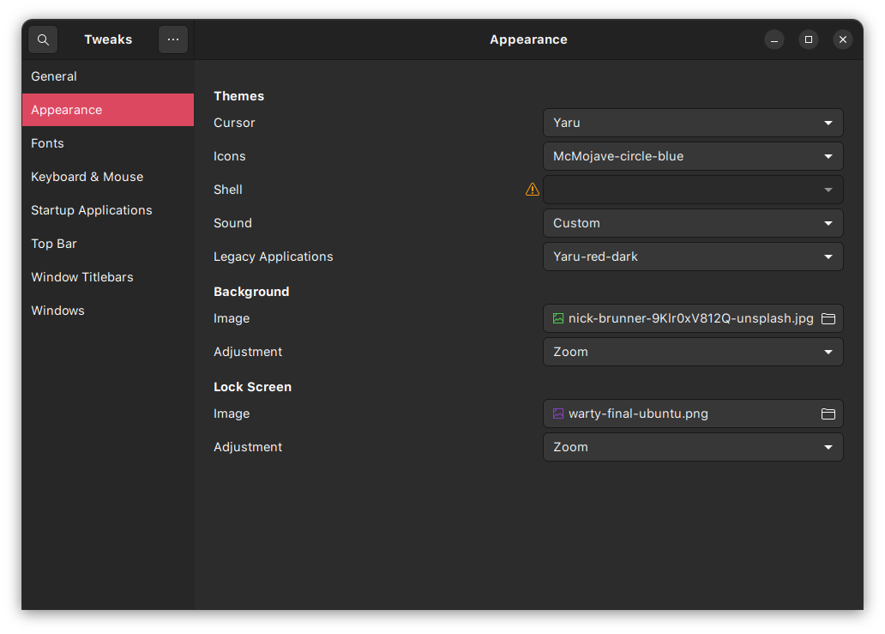
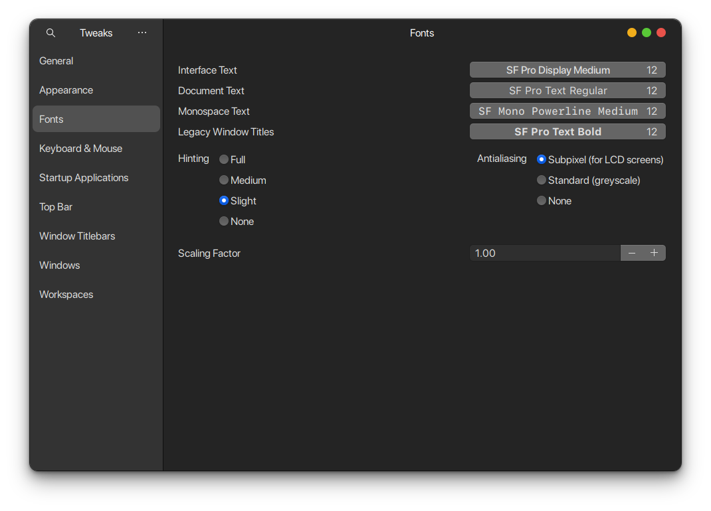
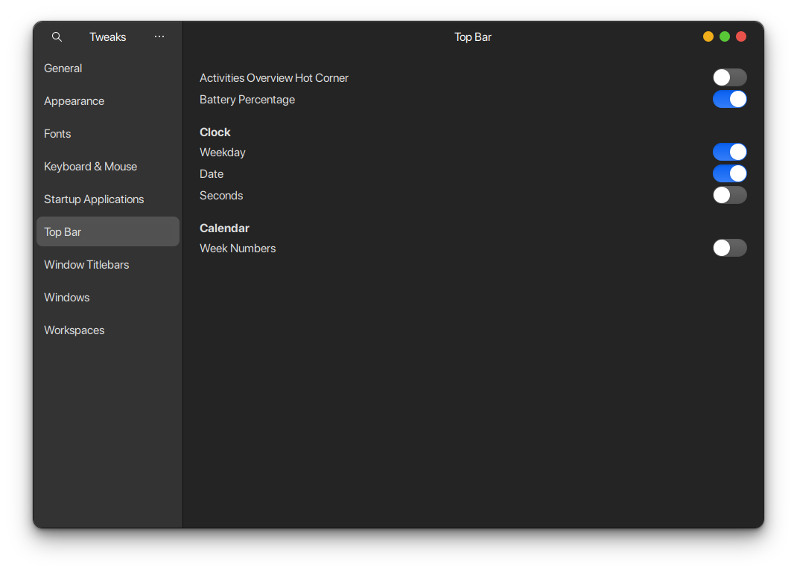

# GUI settings

## Theme

Use the following images as reference to set the theme and fonts

### Apperance


### gnome tweak appearance



### gnome tweak fonts



### gnome tweak topbar



## VSCode

### Enable themes

Press Ctrl+Shift+P and type ```theme```, then change the relevant themes to the ones installed.

Icons: Material

File icons: Material

Color theme: Atom One dark

### Setup fonts for terminal

Add following lines to ```Ctrl+Shift+P > settings.json```

```json
"terminal.integrated.defaultProfile.linux": "zsh",
"terminal.integrated.fontFamily": "SF Mono Powerline",
"terminal.integrated.fontWeight": "400",
"terminal.integrated.fontSize": 15
```

## zshrc settings

change the following

```zsh
ZSH_THEME="agnoster"
plugins=(git sudo copypath copyfile copybuffer dirhistory)
```

## miniconda

comment out or remove the commented code from ```~/.zshrc``` file. This will ensure conda base is not sourced by default but conda commands are still available.

```bash
# >>> conda initialize >>>
# !! Contents within this block are managed by 'conda init' !!
__conda_setup="$('/home/myron/miniconda3/bin/conda' 'shell.bash' 'hook' 2> /dev/null)"
##if [ $? -eq 0 ]; then
#    eval "$__conda_setup"
#else
if [ -f "/home/myron/miniconda3/etc/profile.d/conda.sh" ]; then
    . "/home/myron/miniconda3/etc/profile.d/conda.sh"
else
    export PATH="/home/myron/miniconda3/bin:$PATH"
fi
#fi
#unset __conda_setup
# <<< conda initialize <<<
```
