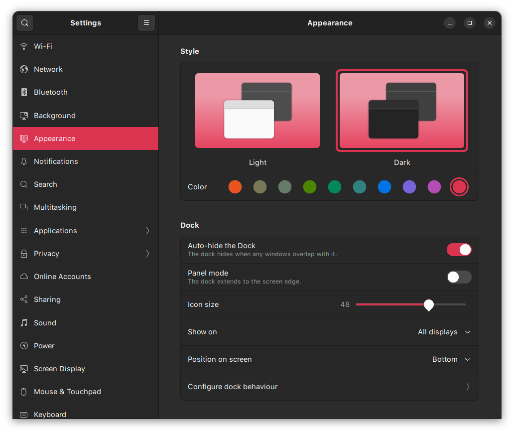

# Desktop setup

Complete desktop setup scripts and resources (mostly from https://www.gnome-look.org/)

## Index

1. Aliases
2. Brave browser
3. Docker + moving docker root
4. Install fonts
5. Install gnome-tweaks
6. Install icons
7. Miniconda setup
8. Opencv 4.5.5 build with contrib modules and intel optimisation
9. ssh keys setup
10. Install gnome themes
11. vscode setup
12. vscode extensions
13. zsh setup

## Theme

Use the following images as reference to set the theme and fonts

### Apperance



### gnome tweak appearance


### gnome tweak fonts


### gnome tweak topbar


## VSCode

### Enable themes

Press Ctrl+Shift+P and type ```theme```, then change the relevant themes to the ones installed.

Icons: Material

File icons: Material

Color theme: Atom One dark

### Setup fonts for terminal

Add following lines to ```Ctrl+Shift+P > settings.json```

```json
"terminal.integrated.defaultProfile.linux": "zsh",
"terminal.integrated.fontFamily": "SF Mono Powerline",
"terminal.integrated.fontWeight": "400",
"terminal.integrated.fontSize": 15
```

## zshrc settings

change the following

```zsh
ZSH_THEME="agnoster"
plugins=(git sudo copypath copyfile copybuffer dirhistory)
```

## miniconda

comment out or remove the commented code from ```~/.zshrc``` file. This will ensure conda base is not sourced by default but conda commands are still available.

```bash
# >>> conda initialize >>>
# !! Contents within this block are managed by 'conda init' !!
__conda_setup="$('/home/myron/miniconda3/bin/conda' 'shell.bash' 'hook' 2> /dev/null)"
##if [ $? -eq 0 ]; then
#    eval "$__conda_setup"
#else
if [ -f "/home/myron/miniconda3/etc/profile.d/conda.sh" ]; then
    . "/home/myron/miniconda3/etc/profile.d/conda.sh"
else
    export PATH="/home/myron/miniconda3/bin:$PATH"
fi
#fi
#unset __conda_setup
# <<< conda initialize <<<
```
