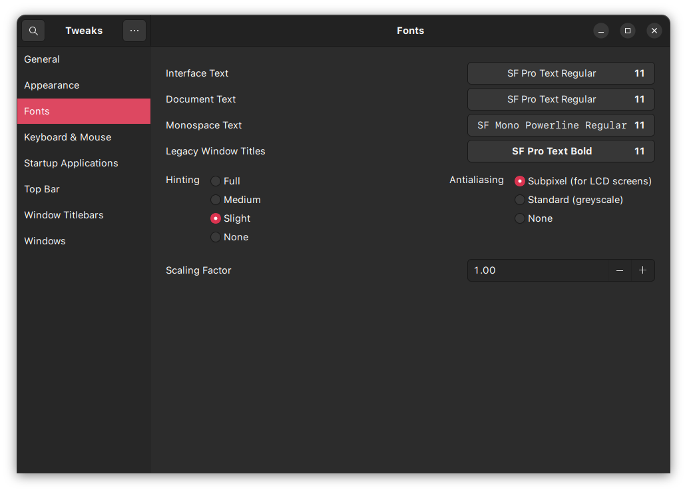
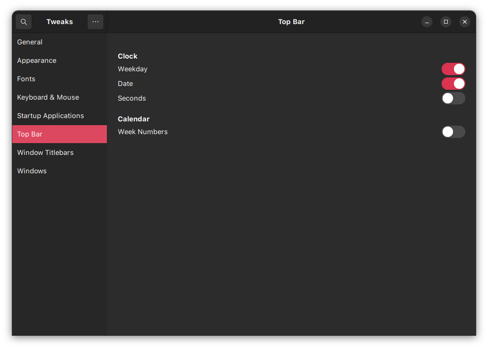

# GUI settings

## Theme

Use the following images as reference to set the theme and fonts

### gnome extensions app


### gnome tweak appearance


### gnome tweak fonts



### gnome tweak topbar



## VSCode

### Enable themes

Press Ctrl+Shift+P and type ```theme```, then change the relevant themes to the ones installed.

Icons: Material

File icons: Material

Color theme: Atom One dark

### Setup fonts for terminal

Add following lines to ```Ctrl+Shift+P > settings.json```

```json
"terminal.integrated.defaultProfile.linux": "zsh",
"terminal.integrated.fontFamily": "SF Mono Powerline",
"terminal.integrated.fontWeight": "400",
"terminal.integrated.fontSize": 15
```

## zshrc settings

change the following

```zsh
ZSH_THEME="agnoster"
plugins=(git sudo copypath copyfile copybuffer dirhistory)
```
